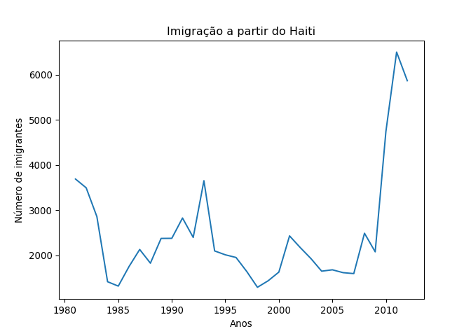
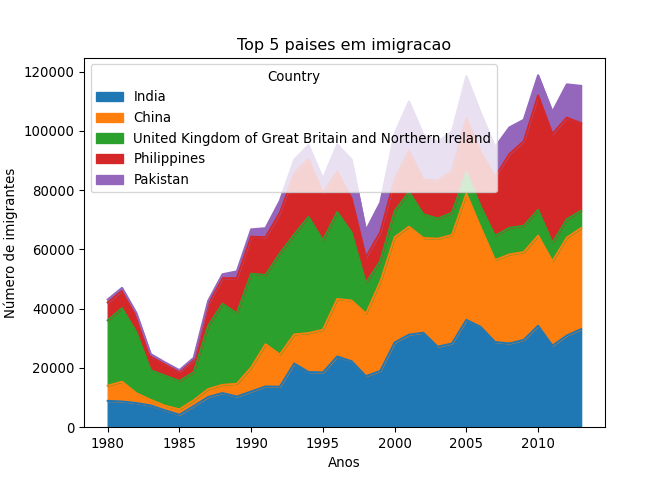
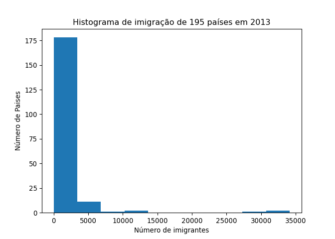
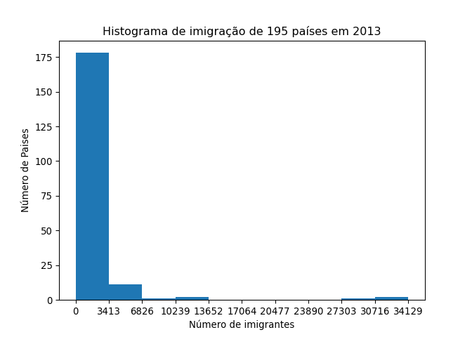
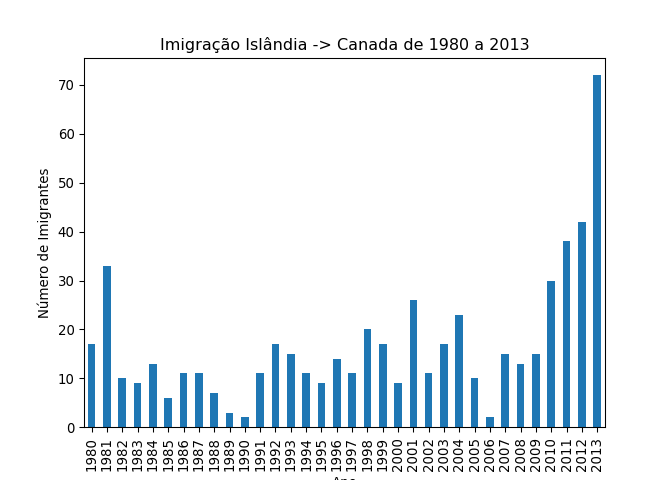
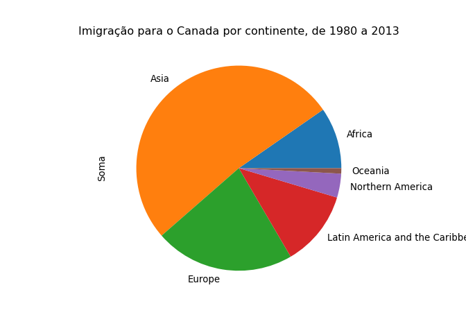
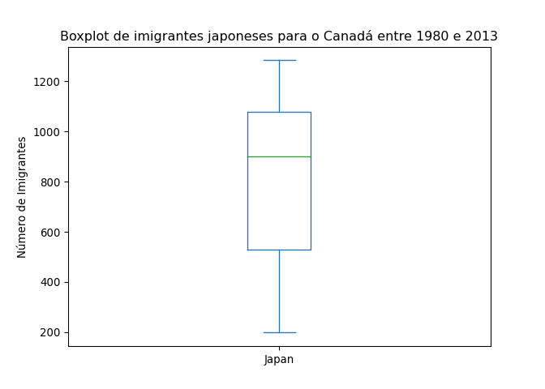

Códigos em R e Python
================
Ramon Moreno Ferrari em
05/06/2022

------------------------------------------------------------------------

## O mais básico: comentando o código

Use \# para comentar o código:

``` r
# Isso é um comentário.
```

O mesmo (#) em Python:

``` python
# Isso também é um comentário!

# Que também é obtido por 3 aspas duplas! """
# (Muito útil para comentar grandes blocos de código rapidamente)
```

## Atribuição

No R, utilize `=` ou `<-` para atribuir o valor a uma variável.

``` r
df<-cars # o sinal de = também funciona!
summary(df)
```

    ##      speed           dist       
    ##  Min.   : 4.0   Min.   :  2.00  
    ##  1st Qu.:12.0   1st Qu.: 26.00  
    ##  Median :15.0   Median : 36.00  
    ##  Mean   :15.4   Mean   : 42.98  
    ##  3rd Qu.:19.0   3rd Qu.: 56.00  
    ##  Max.   :25.0   Max.   :120.00

## Impressão de textos e variáveis

Em R:

``` r
print("oi tudo bem?")
```

    ## [1] "oi tudo bem?"

``` r
print(df$speed)
```

    ##  [1]  4  4  7  7  8  9 10 10 10 11 11 12 12 12 12 13 13 13 13 14 14 14 14 15 15
    ## [26] 15 16 16 17 17 17 18 18 18 18 19 19 19 20 20 20 20 20 22 23 24 24 24 24 25

## Help-me!

Em R, utilize a função help()

``` r
help(print)
```

O mesmo em Python:

``` python
help(print)
```

    ## Help on built-in function print in module builtins:
    ## 
    ## print(...)
    ##     print(value, ..., sep=' ', end='\n', file=sys.stdout, flush=False)
    ##     
    ##     Prints the values to a stream, or to sys.stdout by default.
    ##     Optional keyword arguments:
    ##     file:  a file-like object (stream); defaults to the current sys.stdout.
    ##     sep:   string inserted between values, default a space.
    ##     end:   string appended after the last value, default a newline.
    ##     flush: whether to forcibly flush the stream.

## Including Plots

Os plots são incluídos no Rmd. No R, utilize plot() ou o package
ggplot2.

``` r
plot(pressure)
```

<!-- -->

Em Python, utilize a biblioteca matplotlib:

``` python
import matplotlib.pyplot as plt
# %matplotlib inline se estivesse num Jupyter Notebook
plt.plot(5,5,'o')
plt.xlabel("eixo X")
plt.ylabel("eixo Y")
plt.title("exemplo de plot")
plt.show()
```

<!-- -->

## Importar uma planilha para o Pandas

``` python
import numpy as np # útil para computação científica em Python
import pandas as pd # pacote para estruturar data frames
from __future__ import print_function # retrocompatibilidade python2
#!pip install xlrd
#print('xlrd instalado!')
df_can = pd.read_excel('https://github.com/ramonferrari/r_and_python/blob/main/Script_files/Canada_new.xlsx?raw=true',sheet_name="Canada by Citizenship",skiprows=range(20),skipfooter=2, engine='openpyxl')
df_can.head()
#list(df_can.columns)
```

    ##          Type    Coverage          OdName  AREA  ...  2010  2011  2012  2013
    ## 0  Immigrants  Foreigners     Afghanistan   935  ...  1758  2203  2635  2004
    ## 1  Immigrants  Foreigners         Albania   908  ...   561   539   620   603
    ## 2  Immigrants  Foreigners         Algeria   903  ...  4752  4325  3774  4331
    ## 3  Immigrants  Foreigners  American Samoa   909  ...     0     0     0     0
    ## 4  Immigrants  Foreigners         Andorra   908  ...     0     0     1     1
    ## 
    ## [5 rows x 43 columns]

``` python
df_can.columns = df_can.columns.astype(str)
```

``` python
years=list(map(str,range(1980,2014)))
years_num = list(map(int,years))
df_can['Soma']=df_can[years].sum(axis=1)
df_can.head()
```

    ##          Type    Coverage          OdName  AREA  ...  2011  2012  2013   Soma
    ## 0  Immigrants  Foreigners     Afghanistan   935  ...  2203  2635  2004  58639
    ## 1  Immigrants  Foreigners         Albania   908  ...   539   620   603  15699
    ## 2  Immigrants  Foreigners         Algeria   903  ...  4325  3774  4331  69439
    ## 3  Immigrants  Foreigners  American Samoa   909  ...     0     0     0      6
    ## 4  Immigrants  Foreigners         Andorra   908  ...     0     1     1     15
    ## 
    ## [5 rows x 44 columns]

``` python
df_can.loc[75,years].plot(kind='line')
plt.xlabel("Anos")
plt.ylabel("Número de imigrantes")
plt.title("Imigração a partir do Haiti")
plt.show()
```

<!-- -->

# Sorting e Transposing um data frame

``` python
df_can.rename(columns={"OdName":"Country"},inplace=True)
df_can=df_can.set_index('Country')
df_can.sort_values(['Soma'],ascending=False,axis=0,inplace=True)
df_can.head()
```

    ##                                                           Type  ...    Soma
    ## Country                                                         ...        
    ## India                                               Immigrants  ...  691904
    ## China                                               Immigrants  ...  659962
    ## United Kingdom of Great Britain and Northern Ir...  Immigrants  ...  551500
    ## Philippines                                         Immigrants  ...  511391
    ## Pakistan                                            Immigrants  ...  241600
    ## 
    ## [5 rows x 43 columns]

``` python
df_top5=df_can.head()
df_top5=df_top5[years].transpose()
```

# Area Plot

``` python
df_top5.plot(kind='area')
plt.xlabel("Anos")
plt.ylabel("Número de imigrantes")
plt.title("Top 5 países em imigração")
plt.show()
```

<!-- -->

# Histogram Plot

``` python
import matplotlib as mpl
import matplotlib.pyplot as plt

df_can['2013'].plot(kind='hist')

plt.title("Histograma de imigração de 195 países em 2013")
plt.ylabel("Número de Paises")
plt.xlabel("Número de imigrantes")

plt.show()
```

<!-- -->

``` python
import matplotlib as mpl
import matplotlib.pyplot as plt
import numpy as np 

count,bin_edges=np.histogram(df_can['2013'])

df_can['2013'].plot(kind='hist',xticks=bin_edges)

plt.title("Histograma de imigração de 195 países em 2013")
plt.ylabel("Número de Paises")
plt.xlabel("Número de imigrantes")

plt.show()
```

<!-- -->

# Gráfico de barras

``` python
df_iceland=df_can.loc['Iceland',years]
df_iceland.plot(kind='bar')

plt.title("Imigração Islândia -> Canada de 1980 a 2013")
plt.ylabel("Número de Imigrantes")
plt.xlabel("Ano")

plt.show()
```

<!-- -->

# Gráfico de pizza

``` python
df_can.rename(columns={"AreaName":"Continent"},inplace=True)
df_continentes=df_can.groupby('Continent',axis=0).sum()
df_continentes=df_continentes.drop(columns=['AREA', 'REG','DEV'])
df_continentes
```

    ##                                   1980   1981   1982  ...    2012    2013     Soma
    ## Continent                                             ...                         
    ## Africa                            3951   4363   3819  ...   38083   38543   618948
    ## Asia                             31025  34314  30214  ...  152218  155075  3317794
    ## Europe                           39760  44802  42720  ...   29177   28691  1410947
    ## Latin America and the Caribbean  13081  15215  16769  ...   27173   24950   765148
    ## Northern America                  9378  10030   9074  ...    7892    8503   241142
    ## Oceania                           1942   1839   1675  ...    1679    1775    55174
    ## 
    ## [6 rows x 35 columns]

``` python
df_continentes['Soma'].plot(kind='pie')
plt.title("Imigração para o Canada por continente, de 1980 a 2013")
plt.show()
```

<!-- -->

# Boxplot

``` python
df_japan=df_can.loc[['Japan'],years].transpose()
import matplotlib as mpl
import matplotlib.pyplot as plt
df_japan.plot(kind='box')

plt.title("Boxplot de imigrantes japoneses para o Canadá entre 1980 e 2013")
plt.ylabel("Número de Imigrantes")

plt.show()
```

<!-- -->

# Gráficos de Dispersão

``` python
df_total=df_continentes.drop(columns=['Soma']).transpose()
df_total = df_total.reset_index(level=0)
df_total.rename(columns={"index":"Year"},inplace=True)
df_total.index.names = ['Index']

df_total['Total']=df_total.sum(axis=1)
```

    ## <string>:1: FutureWarning: Dropping of nuisance columns in DataFrame reductions (with 'numeric_only=None') is deprecated; in a future version this will raise TypeError.  Select only valid columns before calling the reduction.

``` python
df_total=df_total.drop(columns=['Africa','Europe','Latin America and the Caribbean','Northern America','Oceania','Asia'])

marcacoes=columns=['1980','1990','2000','2010']
df_total.plot(kind='scatter',x='Year',y='Total',xticks=marcacoes)

plt.title("Imigração total para o Canada entre 1980 e 2013")
plt.ylabel("Número de Imigrantes")
plt.xlabel("Ano")

plt.show()
```

<!-- -->

# Waffle chart

## Sobre Rmd

Utilizar `echo = FALSE` no RMarkdown faz com que o código não apareça no
output, apenas o resultado (um gráfico, por exemplo!).
