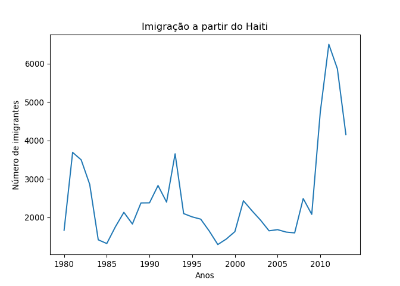
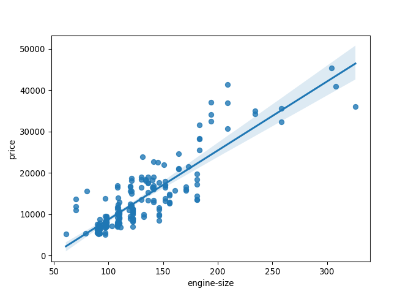
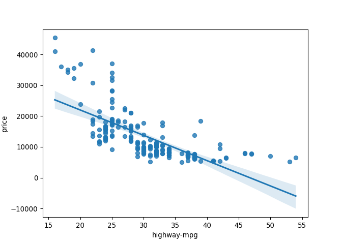
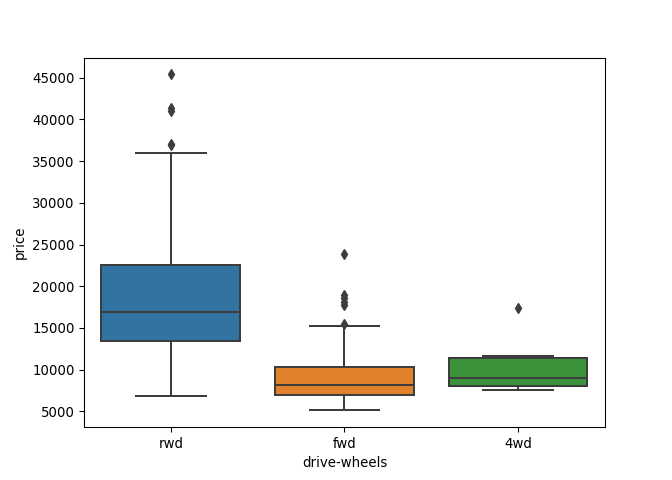
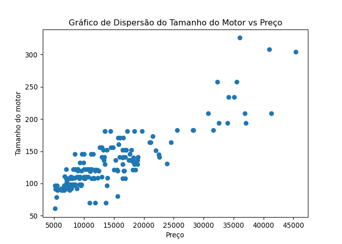
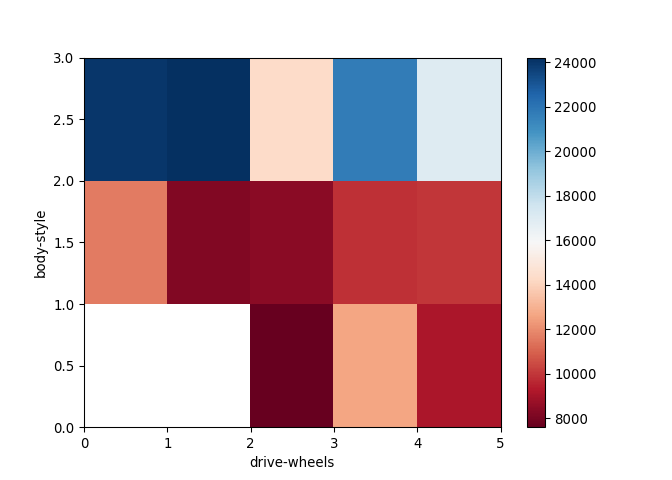
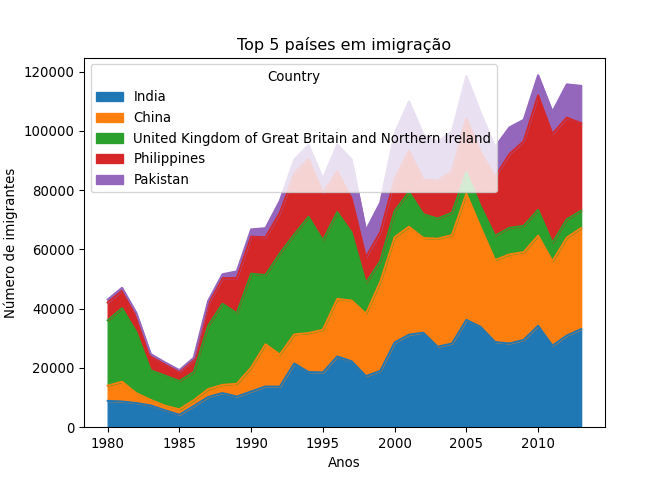
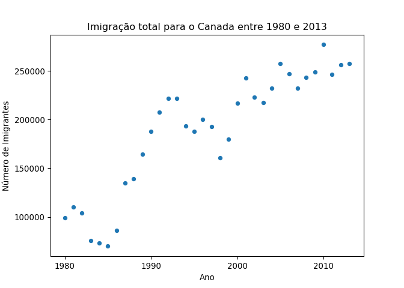

Códigos em R e Python
================
Ramon Moreno Ferrari em
14/06/2022

------------------------------------------------------------------------

## O mais básico: comentando o código

Use \# para comentar o código:

``` r
# Isso é um comentário.
```

O mesmo (#) em Python:

``` python
# Isso também é um comentário!

# Que também é obtido por 3 aspas duplas! """
# (Muito útil para comentar grandes blocos de código rapidamente)
```

## Indentação ou recuo

Indentacao é muito importante em Python.

Utilize TAB ou 4 espaços

``` python
print("nivel 1") # nível 1
if(True):
  print("nivel 2") # nível 2
```

## Atribuição

No R, utilize `=` ou `<-` para atribuir o valor a uma variável.

``` r
df<-cars # o sinal de = também funciona!
summary(df)
```

    ##      speed           dist       
    ##  Min.   : 4.0   Min.   :  2.00  
    ##  1st Qu.:12.0   1st Qu.: 26.00  
    ##  Median :15.0   Median : 36.00  
    ##  Mean   :15.4   Mean   : 42.98  
    ##  3rd Qu.:19.0   3rd Qu.: 56.00  
    ##  Max.   :25.0   Max.   :120.00

## Operações com strings

Atribuição múltipla é possível:

``` python
filho1, filho2, filho3 = "Doug", 'Oliver', 'Savana' # Podemos usar aspas simples ou duplas!
print(filho3)
meus_filhos = "Meus filhos são: " + filho1 + ", " + filho2 + " e " + filho3 + "!"
print(meus_filhos)
```

## Indexação e Slicing

``` python
filho1[0] # em Python, indexação começa pelo zero
filho1[1]
```

``` python
filho1[1:] # exclusivo, mas indiquei o 1
filho2[:2] # exclusivo
filho1[-1] # lendo de tras pra frente
filho2[:-1] # lendo de tras pra frente, exclusivo!
filho3[::2] # pulando dois, começando do zero! 
filho3[::-2] # pulando dois, de trás pra frente!
```

A string é imutável, você não consegue mudar apenas um caractere:

``` python
filho1[1]=G # não, não vai dar Goug!
```

Se você quiser Goug, vai alterar a variável toda:

``` python
filho1="G"+filho1[1:]
filho1
```

Operações são possíveis!

``` python
filho1="D"+filho1[1:]
filho1*3
```

## Números e descobrir tipo da variável

No Python, temos dois tipos principais: inteiro e real.

``` python
type(2)
type(3.14)
float(2)
int(3.14)
```

## Operações com números

No Python, temos dois tipos principais: inteiro e real.

``` python
2+3.14 # soma
3.14-2 #subtração
2*3.14 # multiplicação
3.14/2 # divisão
3.14//2 # quociente da divisão
3.14 % 2 # resto da divisão
3.14 ** 2 # potenciação
```

## Atribuir operando

``` python
z=10
z+=10
z-=10
z*=10
z/=10
z%=10
z**=10
z//=10
```

## Operações lógicas

Igualdade

``` python
3.14 == 2
```

Não igual

``` python
3.14 != 2
```

Maior ou igual que

``` python
3.14 >= 2
```

Maior que

``` python
3.14 > 2
```

Menor ou igual que

``` python
3.14 <= 2
```

Menor que

``` python
3.14 < 2
```

Operador e

``` python
3.14 == 2 and 3.14 != 2
```

Operador ou

``` python
3.14 == 2 or 3.14 != 2
```

Operador not

``` python
not(3.14 == 2 and 3.14 != 2)
```

## Impressão de textos e variáveis

Em R:

``` r
print("oi tudo bem?")
```

    ## [1] "oi tudo bem?"

``` r
print(df$speed)
```

    ##  [1]  4  4  7  7  8  9 10 10 10 11 11 12 12 12 12 13 13 13 13 14 14 14 14 15 15
    ## [26] 15 16 16 17 17 17 18 18 18 18 19 19 19 20 20 20 20 20 22 23 24 24 24 24 25

## Help-me!

Em R, utilize a função help()

``` r
help(print)
```

O mesmo em Python:

``` python
help(print)
```

    ## Help on built-in function print in module builtins:
    ## 
    ## print(...)
    ##     print(value, ..., sep=' ', end='\n', file=sys.stdout, flush=False)
    ##     
    ##     Prints the values to a stream, or to sys.stdout by default.
    ##     Optional keyword arguments:
    ##     file:  a file-like object (stream); defaults to the current sys.stdout.
    ##     sep:   string inserted between values, default a space.
    ##     end:   string appended after the last value, default a newline.
    ##     flush: whether to forcibly flush the stream.

## Including Plots

Os plots são incluídos no Rmd. No R, utilize plot() ou o package
ggplot2.

``` r
plot(pressure)
```

<!-- -->

Em Python, utilize a biblioteca matplotlib:

``` python
import matplotlib.pyplot as plt
# %matplotlib inline se estivesse num Jupyter Notebook
plt.plot(5,5,'o')
plt.xlabel("eixo X")
plt.ylabel("eixo Y")
plt.title("exemplo de plot")
plt.show()
```

<!-- -->

## Importar uma planilha para o Pandas

``` python
import numpy as np # útil para computação científica em Python
import pandas as pd # pacote para estruturar data frames
from __future__ import print_function # retrocompatibilidade python2
#!pip install xlrd
#print('xlrd instalado!')
df_can = pd.read_excel('https://github.com/ramonferrari/r_and_python/raw/main/intro_python_files/Canada_new.xlsx?raw=true',sheet_name="Canada by Citizenship",skiprows=range(20),skipfooter=2, engine='openpyxl')
df_can.head()
#list(df_can.columns)
```

    ##          Type    Coverage          OdName  AREA  ...  2010  2011  2012  2013
    ## 0  Immigrants  Foreigners     Afghanistan   935  ...  1758  2203  2635  2004
    ## 1  Immigrants  Foreigners         Albania   908  ...   561   539   620   603
    ## 2  Immigrants  Foreigners         Algeria   903  ...  4752  4325  3774  4331
    ## 3  Immigrants  Foreigners  American Samoa   909  ...     0     0     0     0
    ## 4  Immigrants  Foreigners         Andorra   908  ...     0     0     1     1
    ## 
    ## [5 rows x 43 columns]

``` python
df_can.columns = df_can.columns.astype(str)
```

``` python
years=list(map(str,range(1980,2014)))
years_num = list(map(int,years))
df_can['Soma']=df_can[years].sum(axis=1)
df_can.head()
```

    ##          Type    Coverage          OdName  AREA  ...  2011  2012  2013   Soma
    ## 0  Immigrants  Foreigners     Afghanistan   935  ...  2203  2635  2004  58639
    ## 1  Immigrants  Foreigners         Albania   908  ...   539   620   603  15699
    ## 2  Immigrants  Foreigners         Algeria   903  ...  4325  3774  4331  69439
    ## 3  Immigrants  Foreigners  American Samoa   909  ...     0     0     0      6
    ## 4  Immigrants  Foreigners         Andorra   908  ...     0     1     1     15
    ## 
    ## [5 rows x 44 columns]

``` python
df_can.loc[75,years].plot(kind='line')
plt.xlabel("Anos")
plt.ylabel("Número de imigrantes")
plt.title("Imigração a partir do Haiti")
plt.show()
```

<!-- -->

# Lendo um CSV

``` python
import pandas as pd
url='https://raw.githubusercontent.com/ramonferrari/r_and_python/main/intro_python_files/imports-85.data'
df=pd.read_csv(url,header=None)
# Para exportar, use df.to_csv(path)
headers = ["symboling","normalized-losses","make","fuel-type","aspiration", "num-of-doors","body-style", "drive-wheels","engine-location","wheel-base", "length","width","height","curb-weight","engine-type", "num-of-cylinders", "engine-size","fuel-system","bore","stroke","compression-ratio","horsepower", "peak-rpm","city-mpg","highway-mpg","price"]
df.columns=headers
#df.tail(n)
df.head()
```

    ##    symboling normalized-losses         make  ... city-mpg highway-mpg  price
    ## 0          3                 ?  alfa-romero  ...       21          27  13495
    ## 1          3                 ?  alfa-romero  ...       21          27  16500
    ## 2          1                 ?  alfa-romero  ...       19          26  16500
    ## 3          2               164         audi  ...       24          30  13950
    ## 4          2               164         audi  ...       18          22  17450
    ## 
    ## [5 rows x 26 columns]

# Entendendo o dataset

``` python
df.dtypes
```

    ## symboling              int64
    ## normalized-losses     object
    ## make                  object
    ## fuel-type             object
    ## aspiration            object
    ## num-of-doors          object
    ## body-style            object
    ## drive-wheels          object
    ## engine-location       object
    ## wheel-base           float64
    ## length               float64
    ## width                float64
    ## height               float64
    ## curb-weight            int64
    ## engine-type           object
    ## num-of-cylinders      object
    ## engine-size            int64
    ## fuel-system           object
    ## bore                  object
    ## stroke                object
    ## compression-ratio    float64
    ## horsepower            object
    ## peak-rpm              object
    ## city-mpg               int64
    ## highway-mpg            int64
    ## price                 object
    ## dtype: object

``` python
df.describe()
```

    ##         symboling  wheel-base  ...    city-mpg  highway-mpg
    ## count  205.000000  205.000000  ...  205.000000   205.000000
    ## mean     0.834146   98.756585  ...   25.219512    30.751220
    ## std      1.245307    6.021776  ...    6.542142     6.886443
    ## min     -2.000000   86.600000  ...   13.000000    16.000000
    ## 25%      0.000000   94.500000  ...   19.000000    25.000000
    ## 50%      1.000000   97.000000  ...   24.000000    30.000000
    ## 75%      2.000000  102.400000  ...   30.000000    34.000000
    ## max      3.000000  120.900000  ...   49.000000    54.000000
    ## 
    ## [8 rows x 10 columns]

``` python
df.describe(include="all") # mostra ainda que tenham NaNs
```

    ##          symboling normalized-losses    make  ...    city-mpg highway-mpg price
    ## count   205.000000               205     205  ...  205.000000  205.000000   205
    ## unique         NaN                52      22  ...         NaN         NaN   187
    ## top            NaN                 ?  toyota  ...         NaN         NaN     ?
    ## freq           NaN                41      32  ...         NaN         NaN     4
    ## mean      0.834146               NaN     NaN  ...   25.219512   30.751220   NaN
    ## std       1.245307               NaN     NaN  ...    6.542142    6.886443   NaN
    ## min      -2.000000               NaN     NaN  ...   13.000000   16.000000   NaN
    ## 25%       0.000000               NaN     NaN  ...   19.000000   25.000000   NaN
    ## 50%       1.000000               NaN     NaN  ...   24.000000   30.000000   NaN
    ## 75%       2.000000               NaN     NaN  ...   30.000000   34.000000   NaN
    ## max       3.000000               NaN     NaN  ...   49.000000   54.000000   NaN
    ## 
    ## [11 rows x 26 columns]

# Lidando com dados faltantes

Aparecem como NAs, ? ou 0.

``` python
df=df.dropna()
df=df.dropna(axis=0) # remove a linha (da amostra!)
df=df.dropna(axis=1) # remove a coluna inteira!
df=df.dropna(subset=["price"],axis=0) # trata apenas olhando para determinada coluna
df.dropna(subset=["price"],axis=0,inplace=True) # mesmo acima, ja substituindo o dataset df
```

``` python
# Substituia usando df.replace(antigo,novo)
import numpy as np
df["normalized-losses"]=df["normalized-losses"].replace("?",np.nan) # trocamos ? por NaN
df['normalized-losses'] = df['normalized-losses'].astype(float) # convertermos de string para float
media=df["normalized-losses"].mean() # calculamos a media
media
```

    ## 122.0

``` python
df["normalized-losses"].replace(np.nan,media)
```

    ## 0      122.0
    ## 1      122.0
    ## 2      122.0
    ## 3      164.0
    ## 4      164.0
    ##        ...  
    ## 200     95.0
    ## 201     95.0
    ## 202     95.0
    ## 203     95.0
    ## 204     95.0
    ## Name: normalized-losses, Length: 205, dtype: float64

# Acessando, calculando e renomeando colunas

``` python
df["city-mpg"]
```

    ## 0      21
    ## 1      21
    ## 2      19
    ## 3      24
    ## 4      18
    ##        ..
    ## 200    23
    ## 201    19
    ## 202    18
    ## 203    26
    ## 204    19
    ## Name: city-mpg, Length: 205, dtype: int64

``` python
df["city-mpg"]=235/df["city-mpg"]
```

``` python
df.rename(columns={"city-mpg":"city-L/100km"},inplace=True)
df["city-L/100km"]
```

    ## 0      11.190476
    ## 1      11.190476
    ## 2      12.368421
    ## 3       9.791667
    ## 4      13.055556
    ##          ...    
    ## 200    10.217391
    ## 201    12.368421
    ## 202    13.055556
    ## 203     9.038462
    ## 204    12.368421
    ## Name: city-L/100km, Length: 205, dtype: float64

# Normalização de datasets

Seja dividindo pelo máximo, dividindo pelo (máximo - mínimo) após
subtrair o mínimo, ou pelo desvio-padrão após retirar a média,
precisaremos aprender a calcular:

``` python
df["length"]=df["length"]/df["length"].max()
df["length"]=(df["length"]-df["length"].min())/(df["length"].max()-df["length"].min())
df["length"]=(df["length"]-df["length"].mean())/df["length"].std()
```

# Binning (binagem) ou agrupamentos

Parece bastante com os levels do R

``` python
df["price"]=df["price"].replace("?",np.nan) # trocamos ? por NaN
```

# Tratamento de variáveis categóricas

``` python
import pandas as pd
pd.get_dummies(df['fuel-type'])
```

    ##      diesel  gas
    ## 0         0    1
    ## 1         0    1
    ## 2         0    1
    ## 3         0    1
    ## 4         0    1
    ## ..      ...  ...
    ## 200       0    1
    ## 201       0    1
    ## 202       0    1
    ## 203       1    0
    ## 204       0    1
    ## 
    ## [205 rows x 2 columns]

``` python
df['price'] = df['price'].astype(float) # convertermos de string para float
bins = np.linspace(df["price"].min(),df["price"].max(),4) # pega a amplitude e divide em 3 grupos a partir de 4 valores!
group_names = ["Low","Medium","High"]
df["price_binned"]=pd.cut(df["price"],bins,labels=group_names,include_lowest=True)
df["price_binned"]
```

    ## 0         Low
    ## 1         Low
    ## 2         Low
    ## 3         Low
    ## 4         Low
    ##         ...  
    ## 200       Low
    ## 201    Medium
    ## 202    Medium
    ## 203    Medium
    ## 204    Medium
    ## Name: price_binned, Length: 205, dtype: category
    ## Categories (3, object): ['Low' < 'Medium' < 'High']

# Correlação de variáveis

``` python
import seaborn as sns
from scipy import integrate, special, stats

df1=df.dropna(subset=["price","engine-size",'highway-mpg'],axis=0)
df1['price'] = df1['price'].astype(float)
```

    ## <string>:1: SettingWithCopyWarning: 
    ## A value is trying to be set on a copy of a slice from a DataFrame.
    ## Try using .loc[row_indexer,col_indexer] = value instead
    ## 
    ## See the caveats in the documentation: https://pandas.pydata.org/pandas-docs/stable/user_guide/indexing.html#returning-a-view-versus-a-copy

``` python
sns.regplot(x="engine-size",y="price",data=df1)
plt.show()
```

<!-- -->

``` python
pearson_coef,p_value=stats.pearsonr(df1['engine-size'],df1['price'])
pearson_coef
```

    ## 0.8723351674455185

``` python
p_value
```

    ## 9.265491622198389e-64

``` python
sns.regplot(x="highway-mpg",y="price",data=df1)
plt.show()
```

<!-- -->

``` python
pearson_coef,p_value=stats.pearsonr(df1['highway-mpg'],df1['price'])
pearson_coef
```

    ## -0.7046922650589529

``` python
p_value
```

    ## 1.7495471144477352e-31

Para correlacionar variáveis categóricas (chamamos de associação),
utilizamos o teste de
,
que testa a probabilidade da distribuição de uma observação ser
aleatória. O teste

testa a hipótese nula que as variáveis são independentes, dizendo que um
relacionamento existe ou não, mas sem dizer o tipo deste relacionamento.

Para o resultado do teste obtendo um p-valor menor que 0.5, rejeita-se a
hipótese numa que as variáveis são independentes e conclui-se que temos
evidências de associação entre as duas variáveis categóricas.

``` python
import scipy
from scipy import stats
scipy.stats.chi2_contingency(cont_table,correction=True)
# nao se falou como se faz cont_table
```

# Estatística Descritiva

``` python
df["drive-wheels"].describe()
```

    ## count     205
    ## unique      3
    ## top       fwd
    ## freq      120
    ## Name: drive-wheels, dtype: object

``` python
df["drive-wheels"].value_counts() # cria uma nova serie com valores e contagem
```

    ## fwd    120
    ## rwd     76
    ## 4wd      9
    ## Name: drive-wheels, dtype: int64

``` python
import seaborn as sns
sns.boxplot(x="drive-wheels",y="price",data=df)
```

<!-- -->

``` python
import matplotlib.pyplot as plt
x = df["price"]
y = df["engine-size"]
plt.scatter(x,y)
plt.xlabel("Preço")
plt.ylabel("Tamanho do motor")
plt.title("Gráfico de Dispersão do Tamanho do Motor vs Preço")
plt.show()
```

<!-- -->

# Agrupando dados (categóricos)

``` python
df_test=df[['drive-wheels','body-style','price']]
df_group=df_test.groupby(['drive-wheels','body-style'],as_index=False).mean()
df_test
```

    ##     drive-wheels   body-style    price
    ## 0            rwd  convertible  13495.0
    ## 1            rwd  convertible  16500.0
    ## 2            rwd    hatchback  16500.0
    ## 3            fwd        sedan  13950.0
    ## 4            4wd        sedan  17450.0
    ## ..           ...          ...      ...
    ## 200          rwd        sedan  16845.0
    ## 201          rwd        sedan  19045.0
    ## 202          rwd        sedan  21485.0
    ## 203          rwd        sedan  22470.0
    ## 204          rwd        sedan  22625.0
    ## 
    ## [205 rows x 3 columns]

``` python
df_group
```

    ##    drive-wheels   body-style         price
    ## 0           4wd    hatchback   7603.000000
    ## 1           4wd        sedan  12647.333333
    ## 2           4wd        wagon   9095.750000
    ## 3           fwd  convertible  11595.000000
    ## 4           fwd      hardtop   8249.000000
    ## 5           fwd    hatchback   8396.387755
    ## 6           fwd        sedan   9811.800000
    ## 7           fwd        wagon   9997.333333
    ## 8           rwd  convertible  23949.600000
    ## 9           rwd      hardtop  24202.714286
    ## 10          rwd    hatchback  14337.777778
    ## 11          rwd        sedan  21711.833333
    ## 12          rwd        wagon  16994.222222

# Pivotando!

``` python
df_pivot=df_group.pivot(index='drive-wheels',columns='body-style')
df_pivot
```

    ##                    price                ...                            
    ## body-style   convertible       hardtop  ...         sedan         wagon
    ## drive-wheels                            ...                            
    ## 4wd                  NaN           NaN  ...  12647.333333   9095.750000
    ## fwd              11595.0   8249.000000  ...   9811.800000   9997.333333
    ## rwd              23949.6  24202.714286  ...  21711.833333  16994.222222
    ## 
    ## [3 rows x 5 columns]

``` python
plt.pcolor(df_pivot,cmap='RdBu')
plt.colorbar()
```

    ## <matplotlib.colorbar.Colorbar object at 0x0000000065BA1610>

``` python
plt.xlabel("drive-wheels")
plt.ylabel("body-style")
plt.show()
```

<!-- -->

# Sorting e Transposing um data frame

``` python
df_can.rename(columns={"OdName":"Country"},inplace=True)
df_can=df_can.set_index('Country')
df_can.sort_values(['Soma'],ascending=False,axis=0,inplace=True)
df_can.head()
```

    ##                                                           Type  ...    Soma
    ## Country                                                         ...        
    ## India                                               Immigrants  ...  691904
    ## China                                               Immigrants  ...  659962
    ## United Kingdom of Great Britain and Northern Ir...  Immigrants  ...  551500
    ## Philippines                                         Immigrants  ...  511391
    ## Pakistan                                            Immigrants  ...  241600
    ## 
    ## [5 rows x 43 columns]

``` python
df_top5=df_can.head()
df_top5=df_top5[years].transpose()
```

# Area Plot

``` python
df_top5.plot(kind='area')
plt.xlabel("Anos")
plt.ylabel("Número de imigrantes")
plt.title("Top 5 países em imigração")
plt.show()
```

<!-- -->

# Histogram Plot

``` python
import matplotlib as mpl
import matplotlib.pyplot as plt

df_can['2013'].plot(kind='hist')

plt.title("Histograma de imigração de 195 países em 2013")
plt.ylabel("Número de Paises")
plt.xlabel("Número de imigrantes")

plt.show()
```

<!-- -->

``` python
import matplotlib as mpl
import matplotlib.pyplot as plt
import numpy as np 

count,bin_edges=np.histogram(df_can['2013'])

df_can['2013'].plot(kind='hist',xticks=bin_edges)

plt.title("Histograma de imigração de 195 países em 2013")
plt.ylabel("Número de Paises")
plt.xlabel("Número de imigrantes")

plt.show()
```

<!-- -->

# Gráfico de barras

``` python
df_iceland=df_can.loc['Iceland',years]
df_iceland.plot(kind='bar')

plt.title("Imigração Islândia -> Canada de 1980 a 2013")
plt.ylabel("Número de Imigrantes")
plt.xlabel("Ano")

plt.show()
```

<!-- -->

# Gráfico de pizza

``` python
df_can.rename(columns={"AreaName":"Continent"},inplace=True)
df_continentes=df_can.groupby('Continent',axis=0).sum()
df_continentes=df_continentes.drop(columns=['AREA', 'REG','DEV'])
df_continentes
```

    ##                                   1980   1981   1982  ...    2012    2013     Soma
    ## Continent                                             ...                         
    ## Africa                            3951   4363   3819  ...   38083   38543   618948
    ## Asia                             31025  34314  30214  ...  152218  155075  3317794
    ## Europe                           39760  44802  42720  ...   29177   28691  1410947
    ## Latin America and the Caribbean  13081  15215  16769  ...   27173   24950   765148
    ## Northern America                  9378  10030   9074  ...    7892    8503   241142
    ## Oceania                           1942   1839   1675  ...    1679    1775    55174
    ## 
    ## [6 rows x 35 columns]

``` python
df_continentes['Soma'].plot(kind='pie')
plt.title("Imigração para o Canada por continente, de 1980 a 2013")
plt.show()
```

<!-- -->

# Boxplot

``` python
df_japan=df_can.loc[['Japan'],years].transpose()
import matplotlib as mpl
import matplotlib.pyplot as plt
df_japan.plot(kind='box')

plt.title("Boxplot de imigrantes japoneses para o Canadá entre 1980 e 2013")
plt.ylabel("Número de Imigrantes")

plt.show()
```

<!-- -->

# Gráficos de Dispersão

``` python
df_total=df_continentes.drop(columns=['Soma']).transpose()
df_total = df_total.reset_index(level=0)
df_total.rename(columns={"index":"Year"},inplace=True)
df_total.index.names = ['Index']

df_total['Total']=df_total.sum(axis=1)
```

    ## <string>:1: FutureWarning: Dropping of nuisance columns in DataFrame reductions (with 'numeric_only=None') is deprecated; in a future version this will raise TypeError.  Select only valid columns before calling the reduction.

``` python
df_total=df_total.drop(columns=['Africa','Europe','Latin America and the Caribbean','Northern America','Oceania','Asia'])

marcacoes=columns=['1980','1990','2000','2010']
df_total.plot(kind='scatter',x='Year',y='Total',xticks=marcacoes)

plt.title("Imigração total para o Canada entre 1980 e 2013")
plt.ylabel("Número de Imigrantes")
plt.xlabel("Ano")

plt.show()
```

<!-- -->

# Folium

    ## <folium.folium.Map object at 0x0000000066369790>

    ## <folium.folium.Map object at 0x0000000066B998E0>

    ## <folium.folium.Map object at 0x0000000066B99430>

Folium deve ser aberto no Jupyter!

# Escrever

## Sobre Rmd

Utilizar `echo = FALSE` no RMarkdown faz com que o código não apareça no
output, apenas o resultado (um gráfico, por exemplo!).
