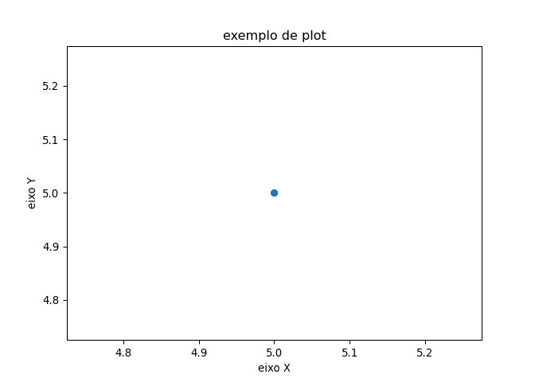

Códigos em R e Python
================
Ramon Moreno Ferrari em
14/06/2022

------------------------------------------------------------------------

## O mais básico: comentando o código

Use \# para comentar o código:

``` python
# Isso é um comentário!

# Que também é obtido por 3 aspas duplas! """
# (Muito útil para comentar grandes blocos de código rapidamente)
```

## Print e Input

Use print() para imprimir strings, variáveis, ou combinações delas. 
``` python
Oi=10
print("Oi")
print(Oi)
print("Oi = ",Oi)
```

Use input() para entrar com dados como uma variável. 
``` python
Oi=input("Entre com o numero")
print(Oi)
```

## Indentação ou recuo

Indentacao é muito importante em Python.

Utilize TAB ou 4 espaços

``` python
print("nivel 1") # nível 1
if(True):
  print("nivel 2") # nível 2
```

## Operações com strings

Atribuição múltipla é possível:

``` python
filho1, filho2, filho3 = "Doug", 'Oliver', 'Savana' # Podemos usar aspas simples ou duplas!
print(filho3)
meus_filhos = "Meus filhos são: " + filho1 + ", " + filho2 + " e " + filho3 + "!"
print(meus_filhos)
```

## Métodos/atributos/funções para strings

Funções built-in:

``` python
meus_filhos.upper()
meus_filhos.lower()
meus_filhos.split()
meus_filhos.split('o')
meus_filhos.capitalize() # apenas primeira em maiúscula
meus_filhos.count('o')
meus_filhos.find('o') # apenas a primeira ocorrência
meus_filhos.islower()
meus_filhos.isspace()
meus_filhos.endswith('a')
```

## Indexação e Slicing

``` python
filho1[0] # em Python, indexação começa pelo zero
filho1[1]
```

``` python
filho1[1:] # exclusivo, mas indiquei o 1
filho2[:2] # exclusivo
filho1[-1] # lendo de tras pra frente
filho2[:-1] # lendo de tras pra frente, exclusivo!
filho3[::2] # pulando dois, começando do zero! 
filho3[::-2] # pulando dois, de trás pra frente!
```

A string é imutável, você não consegue mudar apenas um caractere:

``` python
filho1[1]=G # não, não vai dar Goug!
```

Se você quiser Goug, vai alterar a variável toda:

``` python
filho1="G"+filho1[1:]
filho1
```

Operações são possíveis!

``` python
filho1="D"+filho1[1:]
filho1*3
```

## Números e descobrir tipo da variável

No Python, temos dois tipos principais: inteiro e real.

``` python
type(2)
type(3.14)
float(2)
int(3.14)
type("tudo bem?")
```

## Operações com números

No Python, temos dois tipos principais: inteiro e real.

``` python
2+3.14 # soma
3.14-2 #subtração
2*3.14 # multiplicação
3.14/2 # divisão
3.14//2 # quociente da divisão
3.14 % 2 # resto da divisão
3.14 ** 2 # potenciação
```

## Atribuir operando

``` python
z=10
z+=10
z-=10
z*=10
z/=10
z%=10
z**=10
z//=10
```

## Operações lógicas

Igualdade (vale para strings!)

``` python
3.14 == 2
```

Não igual

``` python
3.14 != 2
```

Maior ou igual que

``` python
3.14 >= 2
```

Maior que

``` python
3.14 > 2
```

Menor ou igual que

``` python
3.14 <= 2
```

Menor que

``` python
3.14 < 2
```

Operador e

``` python
3.14 == 2 and 3.14 != 2
```

Operador ou

``` python
3.14 == 2 or 3.14 != 2
```

Operador not

``` python
not(3.14 == 2 and 3.14 != 2)
```

## Help-me!

Utilize a função help() em Python:

``` python
help(print)
```

    ## Help on built-in function print in module builtins:
    ## 
    ## print(...)
    ##     print(value, ..., sep=' ', end='\n', file=sys.stdout, flush=False)
    ##     
    ##     Prints the values to a stream, or to sys.stdout by default.
    ##     Optional keyword arguments:
    ##     file:  a file-like object (stream); defaults to the current sys.stdout.
    ##     sep:   string inserted between values, default a space.
    ##     end:   string appended after the last value, default a newline.
    ##     flush: whether to forcibly flush the stream.

## Estruturas de dados

### Listas

As listas se parecem mais com as sequências/vetores de números/strings.
Utilizamos colchetes `[`,`]` e vírgulas `,`.

``` python
lista=[1,2,3,4,5]
lista
```

    ## [1, 2, 3, 4, 5]

Acesse um item da lista usando `[]`

``` python
lista[4]
```

    ## 5

Listas podem receber outras listas (aninhamento de dados!)

``` python
lista2=[1,2,3,4,5,lista]
lista2
```

    ## [1, 2, 3, 4, 5, [1, 2, 3, 4, 5]]

Para deletar um item da lista, utilize o comando `del`:

``` python
del(lista2[5])
lista2
```

    ## [1, 2, 3, 4, 5]

Operador `in`:

``` python
5 in lista # false
6 in lista # true
```

Funções built-in:

``` python
len(lista)
min(lista)
max(lista)
lista.append(6)
lista.count(5)
lista.index(1)
lista.insert(posicao,elemento)
lista.reverse
lista.remove(5)
lista.sort()
```

Criando uma lista vazia, para incremento posterior!

``` python
newlist=[]
```

### Dicionários

### Tuplas

## Including Plots

Em Python, utilize a biblioteca matplotlib:

``` python
import matplotlib.pyplot as plt
# %matplotlib inline se estivesse num Jupyter Notebook
plt.plot(5,5,'o')
plt.xlabel("eixo X")
plt.ylabel("eixo Y")
plt.title("exemplo de plot")
plt.show()
```

<!-- -->

## Sobre Rmd

Utilizar `echo = FALSE` no RMarkdown faz com que o código não apareça no
output, apenas o resultado (um gráfico, por exemplo!).
