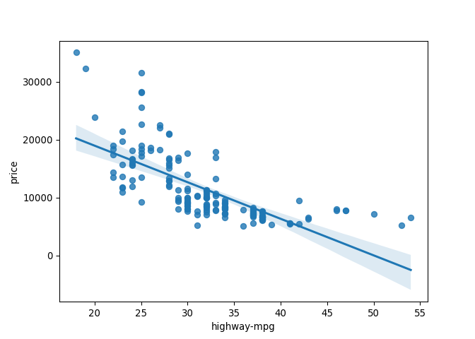
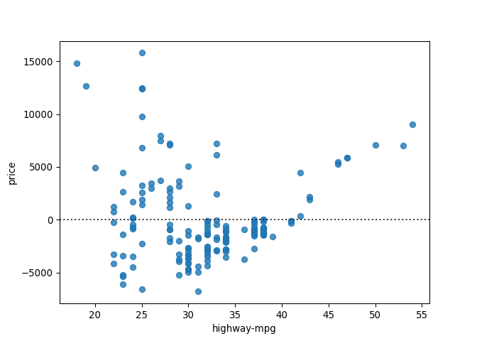
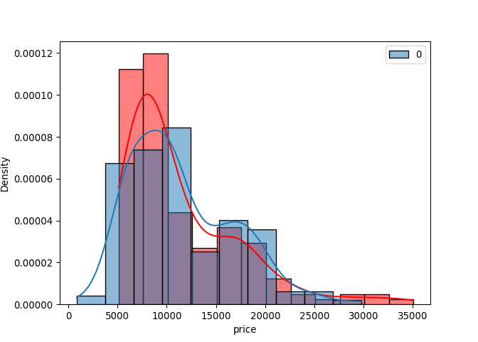
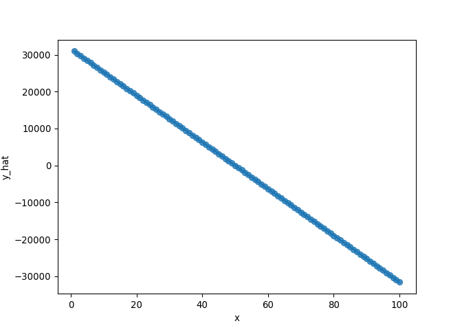
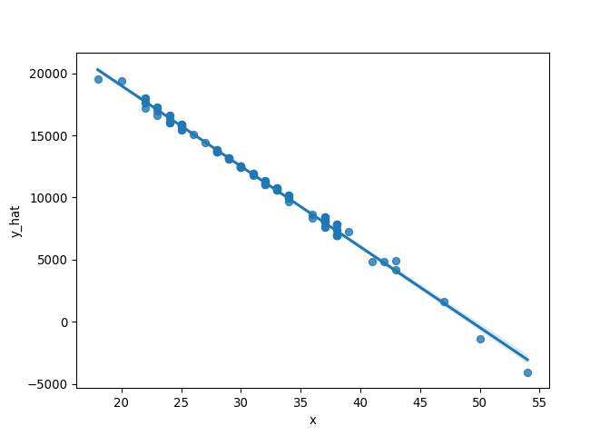

Desenvolvimento de Modelos em Python
================
Ramon Moreno Ferrari em
14/06/2022

------------------------------------------------------------------------

## Baixando o dado

``` python
import pandas as pd
import numpy as np
url='https://raw.githubusercontent.com/ramonferrari/r_and_python/main/intro_python_files/imports-85.data'
df=pd.read_csv(url,header=None)
df
```

    ##      0    1            2       3      4     5   ...    20   21    22  23  24     25
    ## 0     3    ?  alfa-romero     gas    std   two  ...   9.0  111  5000  21  27  13495
    ## 1     3    ?  alfa-romero     gas    std   two  ...   9.0  111  5000  21  27  16500
    ## 2     1    ?  alfa-romero     gas    std   two  ...   9.0  154  5000  19  26  16500
    ## 3     2  164         audi     gas    std  four  ...  10.0  102  5500  24  30  13950
    ## 4     2  164         audi     gas    std  four  ...   8.0  115  5500  18  22  17450
    ## ..   ..  ...          ...     ...    ...   ...  ...   ...  ...   ...  ..  ..    ...
    ## 200  -1   95        volvo     gas    std  four  ...   9.5  114  5400  23  28  16845
    ## 201  -1   95        volvo     gas  turbo  four  ...   8.7  160  5300  19  25  19045
    ## 202  -1   95        volvo     gas    std  four  ...   8.8  134  5500  18  23  21485
    ## 203  -1   95        volvo  diesel  turbo  four  ...  23.0  106  4800  26  27  22470
    ## 204  -1   95        volvo     gas  turbo  four  ...   9.5  114  5400  19  25  22625
    ## 
    ## [205 rows x 26 columns]

``` python
headers = ["symboling","normalized-losses","make","fuel-type","aspiration", "num-of-doors","body-style", "drive-wheels","engine-location","wheel-base", "length","width","height","curb-weight","engine-type", "num-of-cylinders", "engine-size","fuel-system","bore","stroke","compression-ratio","horsepower", "peak-rpm","city-mpg","highway-mpg","price"]
df.columns=headers
df["normalized-losses"]=df["normalized-losses"].replace("?",np.nan) # trocamos ? por NaN
df['normalized-losses'] = df['normalized-losses'].astype(float) # convertermos de string para float
df["price"]=df["price"].replace("?",np.nan) # trocamos ? por NaN
df['price'] = df['price'].astype(float) # convertermos de string para float
df["city-mpg"]=235/df["city-mpg"]
df.rename(columns={"city-mpg":"city-L/100km"},inplace=True)
df.dropna(axis=0,inplace=True) # mesmo acima, ja substituindo o dataset df
df
```

    ##      symboling  normalized-losses   make  ... city-L/100km highway-mpg    price
    ## 3            2              164.0   audi  ...     9.791667          30  13950.0
    ## 4            2              164.0   audi  ...    13.055556          22  17450.0
    ## 6            1              158.0   audi  ...    12.368421          25  17710.0
    ## 8            1              158.0   audi  ...    13.823529          20  23875.0
    ## 10           2              192.0    bmw  ...    10.217391          29  16430.0
    ## ..         ...                ...    ...  ...          ...         ...      ...
    ## 200         -1               95.0  volvo  ...    10.217391          28  16845.0
    ## 201         -1               95.0  volvo  ...    12.368421          25  19045.0
    ## 202         -1               95.0  volvo  ...    13.055556          23  21485.0
    ## 203         -1               95.0  volvo  ...     9.038462          27  22470.0
    ## 204         -1               95.0  volvo  ...    12.368421          25  22625.0
    ## 
    ## [164 rows x 26 columns]

``` python
df.dtypes
```

    ## symboling              int64
    ## normalized-losses    float64
    ## make                  object
    ## fuel-type             object
    ## aspiration            object
    ## num-of-doors          object
    ## body-style            object
    ## drive-wheels          object
    ## engine-location       object
    ## wheel-base           float64
    ## length               float64
    ## width                float64
    ## height               float64
    ## curb-weight            int64
    ## engine-type           object
    ## num-of-cylinders      object
    ## engine-size            int64
    ## fuel-system           object
    ## bore                  object
    ## stroke                object
    ## compression-ratio    float64
    ## horsepower            object
    ## peak-rpm              object
    ## city-L/100km         float64
    ## highway-mpg            int64
    ## price                float64
    ## dtype: object

## Regressão Linear Simples

Preditor ou variável independentes
()
Target ou variável dependente
(),
que denotaremos de

fazendo referência a um modelo. Buscamos uma relação linear do tipo


Onde

é o slope, ou coeficiente angular, e

é o intercept, ou coeficiente linear. A equação cima nos permite
calcular o valor de

para

não pertencentes ao conjunto de treinamento.

### Modelando:

``` python
from sklearn.linear_model import LinearRegression
lm=LinearRegression() # cria um objeto de regressão linear
x=df[['highway-mpg']]
y=df[['price']]
lm.fit(x,y)
```

    ## LinearRegression()

``` python
y_hat=lm.predict(x)
b=lm.intercept_
a=lm.coef_
print("O relacionamento é dado por: \nPrice = ",a,"highway-mpg + ",b)
```

    ## O relacionamento é dado por: 
    ## Price =  [[-631.75258436]] highway-mpg +  [31586.29724467]

## Regressão Linear Múltipla

Buscamos uma relação linear do tipo


``` python
x=df[['horsepower','curb-weight','engine-size','highway-mpg']]
y=df[['price']]
lm.fit(x,y)
```

    ## LinearRegression()

``` python
y_hat=lm.predict(x)
b=lm.intercept_
a=lm.coef_
print("O relacionamento é dado por: \nPrice = ",a[[0],0],"horsepower + ",a[[0],1],"curb-weight + ",a[[0],2],"engine-size + ",a[[0],3],"highway-mpg + ",b)
```

    ## O relacionamento é dado por: 
    ## Price =  [25.34377007] horsepower +  [8.64500785] curb-weight +  [16.79558345] engine-size +  [-2.6715555] highway-mpg +  [-14119.61866258]

## Gráficos de regressão

``` python
import seaborn as sns
sns.regplot(x='highway-mpg',y='price',data=df)
```

<!-- -->

E o plot do valor residual
"):

``` python
import seaborn as sns
sns.residplot(df['highway-mpg'],df['price'])
```

<!-- -->

Para mais variáveis, utilize o gráfico das distribuições:

``` python
import seaborn as sns
ax1=sns.histplot(df['price'],kde=True,stat="density",color="red",label="Valor real")
sns.histplot(y_hat,kde=True,stat="density",color="blue",label="Valores modelados",ax=ax1)
```

<!-- -->

## Regressão polinomial

Unidimensional

``` python
xpol=df['highway-mpg']
ypol=df['price']

f=np.polyfit(xpol,ypol,3)
p=np.poly1d(f)
print(p)
```

    ##          3         2
    ## -0.4822 x + 82.75 x - 4504 x + 8.508e+04

E multidimensional (que conta com normalização no fluxo!)

``` python
xdata=df[['horsepower','curb-weight','engine-size','highway-mpg']]
ydata=df['price']

from sklearn.preprocessing import PolynomialFeatures
pr=PolynomialFeatures(degree=2,include_bias=False)
x_polly=pr.fit_transform(xdata[['horsepower','curb-weight']])

from sklearn.preprocessing import StandardScaler
SCALE=StandardScaler()
SCALE.fit(xdata[['horsepower','curb-weight']])
```

    ## StandardScaler()

``` python
x_scale=SCALE.transform(xdata[['horsepower','curb-weight']])
```

# Com pipelines! Mas tá com zica!

``` python
Input=[('scale',StandardScaler()),('polynomial',PolynomialFeatures(degree=2)),('mode',LinearRegression())]
pipe=Pipeline(Input)
Pipe.fit(df[['horsepower','curb-weight','engine-size','highway-mpg']],y)
y_hat=Pipe.predict(x[['horsepower','curb-weight','engine-size','highway-mpg']])
```

# Avaliação Numérica dos Modelos

Mean Squared Error
")
R-Squared
"),
r-quadrado ou coeficiente de determinação

 ")

``` python
from sklearn.metrics import mean_squared_error
mean_squared_error(y,y_hat) #MSE
```

    ## 6486703.491471654

``` python
lm.fit(df[['highway-mpg']],df['price']) 
```

    ## LinearRegression()

``` python
lm.score(df[['highway-mpg']],df['price']) #R2
```

    ## 0.502872127786816

# Predizendo novos valores a partir dos Modelos

``` python
lm.fit(df[['highway-mpg']],df['price'])
```

    ## LinearRegression()

``` python
lm.predict(np.array(30.0).reshape(-1,1))
```

    ## array([12633.71971379])

Os valores fazem sentido? Modele varios…

``` python
new_input=np.arange(1,101,1).reshape(-1,1)
y_hat=lm.predict(new_input)
df2=pd.DataFrame({'x':np.concatenate(new_input),'y_hat':y_hat.tolist()})
sns.regplot(x='x',y='y_hat',data=df2)
```

<!-- -->

# Concatenate, tolist…

Observe a diferença entre

``` python
df['price']
```

    ## 3      13950.0
    ## 4      17450.0
    ## 6      17710.0
    ## 8      23875.0
    ## 10     16430.0
    ##         ...   
    ## 200    16845.0
    ## 201    19045.0
    ## 202    21485.0
    ## 203    22470.0
    ## 204    22625.0
    ## Name: price, Length: 164, dtype: float64

``` python
df[['price']]
```

    ##        price
    ## 3    13950.0
    ## 4    17450.0
    ## 6    17710.0
    ## 8    23875.0
    ## 10   16430.0
    ## ..       ...
    ## 200  16845.0
    ## 201  19045.0
    ## 202  21485.0
    ## 203  22470.0
    ## 204  22625.0
    ## 
    ## [164 rows x 1 columns]

# Avaliação e refinamento de modelos

Lembra-se dividir o dataset entre trainamento e teste!

``` python
from sklearn.model_selection import train_test_split
x_train, x_test, y_train, y_test = x_train, x_test, y_train, y_test = train_test_split(df['highway-mpg'],df['price'],test_size=0.3,random_state=0)
```

# Cross validation ou validação cruzada

``` python
from sklearn.model_selection import cross_val_score
from sklearn.model_selection import cross_val_predict

lm=LinearRegression()
scores=cross_val_score(lm,x_train.values.reshape(-1,1),y_train.values.reshape(-1,1),cv=3)
scores # valor do R²
```

    ## array([0.4470463 , 0.46439108, 0.55385152])

``` python
y_hat=cross_val_predict(lm,x_train.values.reshape(-1,1),y_train.values.reshape(-1,1),cv=3)

df3=pd.DataFrame({'x':x_train.tolist(),'y_hat':np.concatenate(y_hat)})
sns.regplot(x='x',y='y_hat',data=df3)
```

<!-- -->

# Avaliando o erro de diferentes polinômios

``` python
from sklearn.model_selection import train_test_split
x_train, x_test, y_train, y_test = x_train, x_test, y_train, y_test = train_test_split(df[['horsepower','curb-weight','engine-size','highway-mpg']],df['price'],test_size=0.3,random_state=0)

rsqu_test=[]
order=[1,2,3,4]
for n in order:
    pr=PolynomialFeatures(degree=n)
    x_train_pr=pr.fit_transform(x_train[['horsepower']])
    x_test_pr=pr.fit_transform(x_test[['horsepower']])
    lm.fit(x_train_pr,y_train)
    rsqu_test.append(lm.score(x_test_pr,y_test))
```

    ## LinearRegression()
    ## LinearRegression()
    ## LinearRegression()
    ## LinearRegression()

``` python
rsqu_test
```

    ## [0.6071912543595903, 0.5839685960466299, 0.06372195454185903, -0.03556958821003642]
